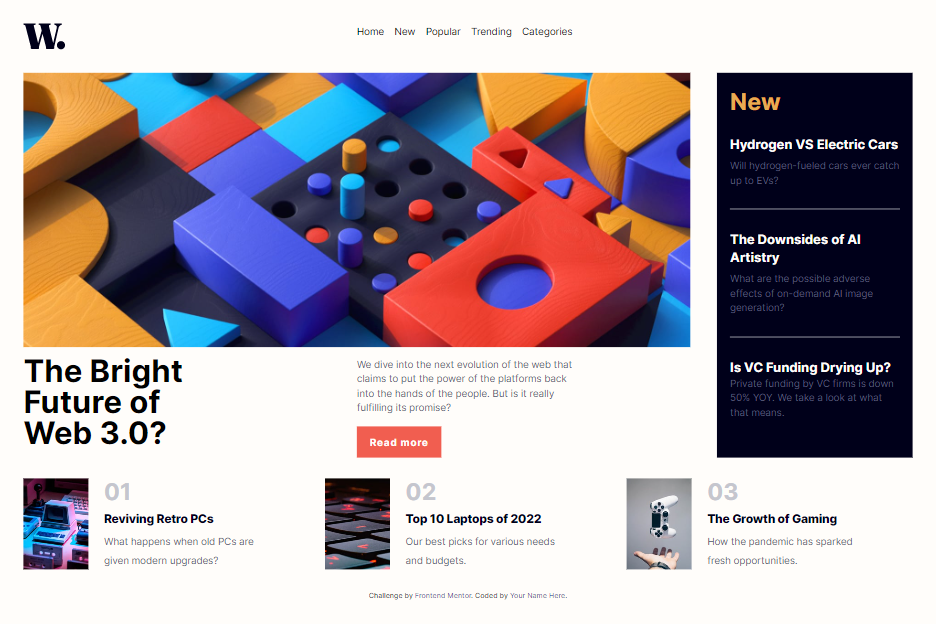

## Table of contents

- [Table of contents](#table-of-contents)
- [Overview](#overview)
  - [The challenge](#the-challenge)
  - [Screenshot](#screenshot)
  - [Links](#links)
- [My process](#my-process)
  - [Built with](#built-with)
  - [What I learned](#what-i-learned)
  - [Continued development](#continued-development)
  - [Useful resources](#useful-resources)
- [Author](#author)
- [Acknowledgments](#acknowledgments)

## Overview
    This is the solution of news homepage challenge. I developed this website with tailwind and mobile first approach.
### The challenge
- Users can view the optimal layout for the interface depending on their devices screen size
- Users can also see hover and focus states for all interactive elements on the page

### Screenshot




### Links

- Solution URL: [Add solution URL here](https://your-solution-url.com)
- Live Site URL: [Add live site URL here](https://your-live-site-url.com)

## My process
    First,I install tailwind css in my project and perform necessary steps like configuring template paths and adding the Tailwind directives to my CSS.Then, I start writing overall html code of mobile version,then I added styles with tailwind css.I also added navigation toggle functionality for mobile navigation menu.When i finished the mobile view,I start adding the responsiveness in my website by working with tailwind responsive breakpoints like md,lg and xl.

### Built with

- Semantic HTML5 markup
- Mobile-first workflow
- [TailwindCSS](https://tailwindcss.com/) -  utility-first CSS framework


### What I learned
Since this is the first time I perform a project with tailwind css, I have learned a lot about tailwind.css. I learned how to add the custom class to tailwind class in  ` tailwind.config.js` like 

```JavaScript
extend: {
      fontSize: {
        paragraph: "0.938rem",
      },
      fontFamily: {
        inter: ["Inter", "sans-serif"],
      },
      colors: {
        offwhite: "hsl(36, 100%, 99%)",
        grayishBlue: "hsl(233, 8%, 79%)",
        darkGrayishBlue: "hsl(236, 13%, 42%)",
        veryDarkBlue: "hsl(240, 100%, 5%)",
        softOrange: "hsl(35, 77%, 62%)",
        softRed: "hsl(5, 85%, 63%)",
      },
    },
```
I also learned @apply of tailwind css and used in the input.css file.
```Css
@layer components {
  .mobile-menu {
    @apply block;
  }

  .mobile-Overlay {
    @apply hidden bg-veryDarkBlue z-10 w-screen h-screen opacity-30 fixed top-0 left-0;
  }
}
```
I also learned the javascript event listeners,querySelector and applied in this project.
```Javascript
    const menuBtn = document.querySelector(".mobile-menu-btn");
const navBar = document.querySelector("nav");
const exitBtn = document.querySelector(".mobile-exitIcon");
const overlay = document.querySelector(".mobile-Overlay");

menuBtn.addEventListener("click", () => {
  navBar.classList.add("mobile-menu");
  overlay.style.display = "block";
});

exitBtn.addEventListener("click", () => {
  navBar.classList.remove("mobile-menu");
  overlay.style.display = "none";
});

```

### Continued development

To say the truth, I am not very sastified with the hero section and sidebar of my website's desktop version and articles sections in tablet version like md and lg breakpoints. I am not also comfortable with the mobile frist workflow and I also needed to focus in developing future projects with mobile first workflow.

### Useful resources

- [Tailwind Documentation](https://tailwindcss.com/docs/installation) - This helped me learn tailwind. I really liked this pattern and will use it going forward.
- [GoogleFonts with tailwind](https://blog.logrocket.com/how-to-use-custom-fonts-tailwind-css/) - This is an amazing article which helped me finally understand how to use googlefonts with tailwind. 
- [Stackoverflow](https://stackoverflow.com/questions/67242334/tailwind-css-how-to-make-a-grid-with-two-columns-where-the-1st-column-has-20)This stackoverflow post is where I get the idea for my grid layout.
- [Designcourse Youtube](https://www.youtube.com/watch?v=D-h8L5hgW-w&t=7441s)This help me build mobile navigation menu.

## Author
- Website - [Add your name here](https://www.your-site.com)
- Frontend Mentor - [@yourusername](https://www.frontendmentor.io/profile/yourusername)
- Twitter - [@yourusername](https://www.twitter.com/yourusername)

## Acknowledgments
 I get some inspiration from resources of these people.
- [Designcourse Youtube](https://www.youtube.com/watch?v=D-h8L5hgW-w&t=7441s)
- [ThisUser From StackOverflow](https://stackoverflow.com/users/184124/horuskol)This user answer this question[Stackoverflow](https://stackoverflow.com/questions/67242334/tailwind-css-how-to-make-a-grid-with-two-columns-where-the-1st-column-has-20) and his answer inspired me to get my grid layout.

